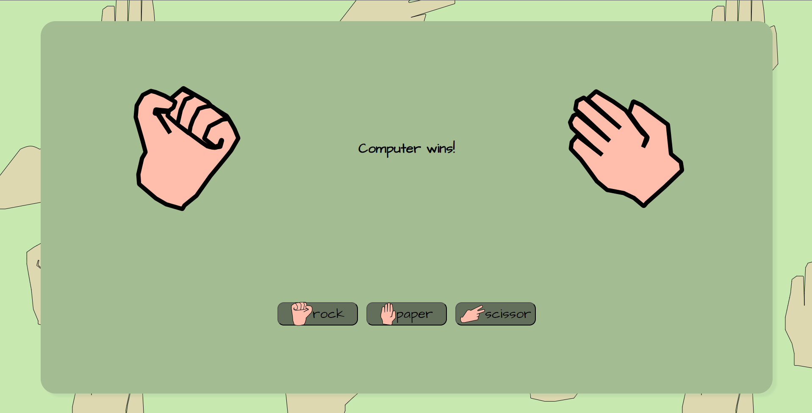

<h1 align="center" id="title">Rock Paper Scissors</h1>

        
    

        
        
        
    

<h2>💻 Technologies used</h2>

#### 💾 Programming languages

-   CSS 3
-   HTML 5
-   JavaScript ES6

#### 🧰 Other tools

-   Git
-   GitHub
-   GitHub Pages
-   VS Code (Vim + Live Server + Prettier)

<h2>🛡️ License:</h2>

This project is licensed under the [MIT License](./LICENSE).
