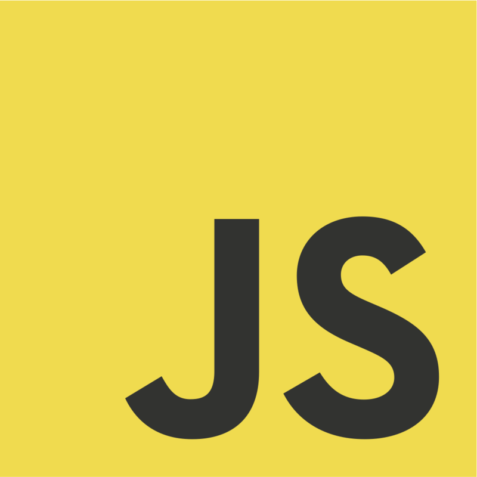

<h1 align="center" id="title" style="font-family: 'Dekko', cursive; font-size: 50px; color: #A4BC92"><strong>Rock Paper Scissors</strong></h1>

 
    

        

            
            
        

        

            <h1>JavaScript RPS</h1>
            <p">by Jeiku Dev

            <h3 style="align: center">A well-known child game, Developed using full JavaScript<h3>
        

    

        
 Game Preview 

        
        
        
        
    

        
        
        
    

 
<h2>✨ Features</h2>

-   The game?

#### 🔜 Soon

-   High Score
-   Score
-   Rounds

#### 🥅 Goal

-   Multiplayer

<h2>💻 Technologies used</h2>

#### 💾 Programming languages

-   JavaScript ES6
-   CSS 3
-   HTML 5

#### 🧰 Other tools

-   Git
-   GitHub
-   GitHub Pages
-   VS Code (Live Server + Prettier)

<h2>🛡️ License</h2>

This project is licensed under the [MIT License](./LICENSE).

